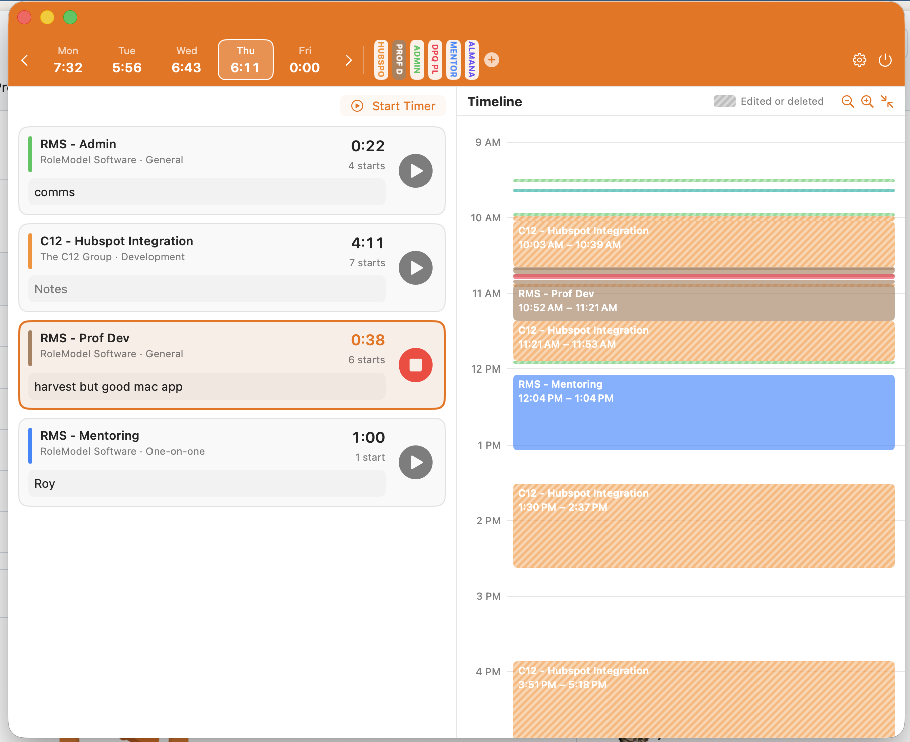

<div align="center">


# Harvest But Good

**The Harvest menu bar app that Harvest should have shipped.**

[](#requirements)
[](Package.swift)
[](#what-you-get)
[](#get-it-running)
[](#the-fine-print)

</div>

---

Harvest honestly has no excuse for how unusable their Mac app is. It's a web page in a trench coat that forgets what you were doing, hides the timer you want, and — the real crime — can't answer the one question a time tracker exists to answer: *when did I actually start and stop working on things today?*

So here's the app Harvest should have shipped.




## What you get

- **Menu bar first.** No Dock icon, no window clutter. Today's total hours sit right next to a tidy timer icon.
- **Favorites at one click.** No dropdown safari.
- **Search that finds things.** Type across project, client, and task names at once — `Billy Dev` turns up the Billy Graham project, and picking it lands you straight on the Development task.
- **An actual day timeline.** A 7 AM–7 PM view with color-coded blocks for every start→stop interval, because "3.2 hours" tells you nothing about where your morning went. Harvest's own API doesn't expose these timestamps — this app logs them itself, locally.
- **Move time where it belongs.** Logged an hour against the wrong task? Right-click the entry, pick **Move Time**, and send some or all of it elsewhere. The day's other entries come first in the list, so the usual fix is two clicks; the whole project list is underneath for everything else. Moved time merges into a matching entry instead of piling up duplicates, and a running timer keeps running — on the destination if the move empties the entry it came from.
- **Inline notes and a full day view.** Edit entry notes in place, jump between days, and see how many times you bounced between tasks (no judgment).
- **Syncs with Harvest every 30 seconds**, so the web and phone apps stay honest too.

## Requirements

- macOS 14+
- Swift toolchain (Command Line Tools are enough — you don't even need Xcode)
- A Harvest Personal Access Token

## Get it running

```sh
git clone git@github.com:jdmcleod/harvest_but_good.git
cd harvest_but_good
Scripts/create-signing-cert.sh   # once — see below
Scripts/build-app.sh              # builds and installs to /Applications
open /Applications/HarvestButGood.app
```

That's it. Look up — it's in your menu bar.

### Why the certificate

Without a signing identity the app gets an ad-hoc signature, which changes with every build. macOS then treats each build as a different app and asks for your Keychain password again — every time.

`Scripts/create-signing-cert.sh` makes a self-signed code-signing certificate called `HarvestButGood Dev`, puts it in your login Keychain, and marks it trusted (one `sudo` prompt). `Scripts/build-app.sh` picks it up automatically. Already have an Apple Development certificate? Skip the script — the build prefers that one, or whatever you set in `CODESIGN_IDENTITY`.

The first launch after signing still asks for the Keychain. Click **Always Allow** rather than **Allow** — "Allow" covers that one read and nothing more, so the next launch asks again.

A self-signed certificate only gets you halfway. It carries no Team ID, and macOS ties the Keychain to the certificate only when there is one; without it, access is pinned to that exact build's hash. So the first launch after each rebuild asks once more, and it is another **Always Allow**. An Apple Development identity has a Team ID and is rid of it for good.

## Connect to Harvest

The app walks you through this on first launch, but here's the shape of it:

1. It opens https://id.getharvest.com/developers for you. Sign in and click **Create new personal access token**; name it `HarvestTimer`.
2. Copy the token and the numeric **Account ID** from the *Choose Account* section on that page.
3. Paste both into the app, click **Validate**, then **Save & Start**.

Both values go straight into the macOS Keychain. Revoke the token from that same Harvest page whenever you like.

## Almanac integration (experimental, `harvest-but-for-luke` branch)

RoleModel's [Almanac](https://almanac.rolemodel.dev) already works out a sensible daily pace for the quarter — your remaining hours spread over your remaining workdays, minus whatever time off you've already booked. This branch can pull that number in as the day's goal, and separately can scale whatever number is driving the goal down for a half day or a day off. The two are independent switches:

- **Use Almanac's suggested pace as the goal** — the day's goal comes from Almanac's pace instead of your hand-typed hours.
- **Adjust for Almanac time off** — whatever's driving the goal (Almanac's pace, or your own hand-typed hours if the switch above is off) gets scaled down for a half day or zeroed for a day off Almanac knows about.

So you can run Almanac's pace outright, keep your own hand-typed hours and just have Almanac nudge them for a half day, or run both together. Your hand-set per-weekday goals stay in place as the fallback whenever neither switch is on, Almanac hasn't answered yet, or its key gets rejected.

**Setup:**

1. In Almanac, open **/api_keys** and create a key.
2. In the app, open the gear → **Daily Pace**, and switch the master toggle on if it isn't already.
3. Under **Almanac**, switch on whichever of the two behaviors above you want, then enter the API key and the email you use at RoleModel. Press Return or click away to save, or use **Sync Now**.
4. The status line shows whatever's relevant to the switches you have on — the pace Almanac sent back with `target`/`worked`/`remaining` and the resolved person id, and/or how many time off items are synced — handy if a number looks off.

**Known rough edges**, since this is still an experiment:

- A same-day time-off entry (say, a half day booked for today) can take a sync cycle to show up — Almanac's own API only returns time off that ends *after* today, so the app leans on what it already cached from when that entry was still "tomorrow."
- Almanac's pace is quarter-scoped, so the last few days of a quarter can look a little off as the remaining hours run down. There's no year-scoped option — Almanac's own API has no equivalent field for it, only the quarter one.
- The API key isn't tied to your identity in Almanac — it's your key *and* the email you enter together that determine whose pace and time off come back.

## Staying up to date

The build stamps the commit it came from into the app bundle. Open the gear, and **Check for Updates** asks GitHub what has landed on `main` since then. It tells you and stops there — it downloads nothing and replaces nothing:

```sh
git pull && Scripts/build-app.sh
```

Quit and reopen afterwards. The card is honest about the awkward cases: a build made with uncommitted changes says so, and a build from your own branch is told it's off `main` rather than behind it.

Nothing is checked unless you ask. The check needs no token, because the repo is public, but that also means GitHub's anonymous rate limit applies — roughly 60 checks an hour from one address, far more than anyone needs.

If you want this to become a real one-click updater, [Sparkle](https://github.com/sparkle-project/Sparkle) is the standard answer. It wants a Developer ID certificate and notarized builds first — worth knowing that the same Developer ID also puts an end to the Keychain prompts above.

## The fine print

Timers started or stopped elsewhere (web, phone) still show up in the entry list, but they won't draw timeline blocks — Harvest's API keeps those timestamps to itself. Local data (favorites and the start/stop log) lives in `~/Library/Application Support/HarvestTimer/`.
