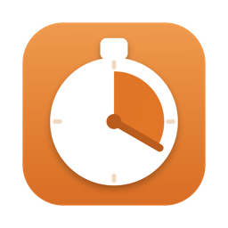

<div align="center">



# Harvest But Good

**The Harvest menu bar app that Harvest should have shipped.**

[](#requirements)
[](Package.swift)
[](#what-you-get)
[](#get-it-running)
[](#the-fine-print)

</div>

---

Harvest honestly has no excuse for how unusable their Mac app is. It's a web page in a trench coat that forgets what you were doing, hides the timer you want, and — the real crime — can't answer the one question a time tracker exists to answer: *when did I actually start and stop working on things today?*

So here's the app Harvest should have shipped.

## What you get

- **Menu bar first.** No Dock icon, no window clutter. Today's total hours sit right next to a tidy timer icon.
- **Favorites as cards.** One click starts (or restarts) a timer for a project + task. No dropdown safari.
- **An actual day timeline.** A 7 AM–7 PM view with color-coded blocks for every start→stop interval, because "3.2 hours" tells you nothing about where your morning went. Harvest's own API doesn't expose these timestamps — this app logs them itself, locally.
- **Inline notes and a full day view.** Edit entry notes in place, jump between days, and see how many times you bounced between tasks (no judgment).
- **Syncs with Harvest every 30 seconds**, so the web and phone apps stay honest too.

## Requirements

- macOS 14+
- Swift toolchain (Command Line Tools are enough — you don't even need Xcode)
- A Harvest Personal Access Token

## Get it running

```sh
git clone git@github.com:jdmcleod/harvest_but_good.git
cd harvest_but_good
Scripts/build-app.sh
cp -R dist/HarvestTimer.app /Applications/
open /Applications/HarvestTimer.app
```

That's it. Look up — it's in your menu bar.

## Connect to Harvest

The app walks you through this on first launch, but here's the shape of it:

1. It opens https://id.getharvest.com/developers for you. Sign in and click **Create new personal access token**; name it `HarvestTimer`.
2. Copy the token and the numeric **Account ID** from the *Choose Account* section on that page.
3. Paste both into the app, click **Validate**, then **Save & Start**.

Both values go straight into the macOS Keychain. Revoke the token from that same Harvest page whenever you like.

## The fine print

Timers started or stopped elsewhere (web, phone) still show up in the entry list, but they won't draw timeline blocks — Harvest's API keeps those timestamps to itself. Local data (favorites and the start/stop log) lives in `~/Library/Application Support/HarvestTimer/`.